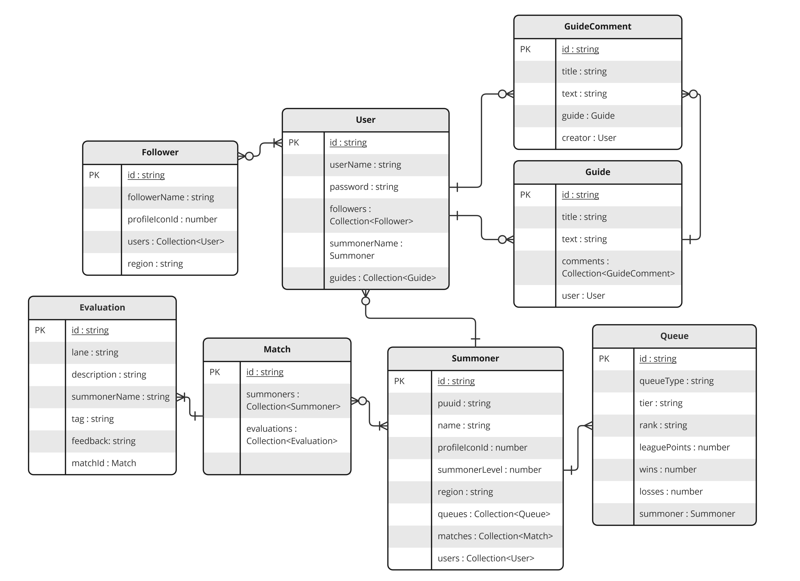

# BACKEND
## **Datenbankmodell**



## **Verfügbare Routen**
#### **Authentifikation**
```
POST    auth/register                   registriert einen user mit summoner (riotApi | DB)
POST    auth/login                      login für user
PUT     auth/update                     aktualisiert den summoner (riotApi | DB) für einen user
```
#### **Summoner**
```
PUT     summoner/updateSummoner         updated einen summoner mittels riotApi
```
#### **Follower**
```
GET     follower/                       holt alle follower für einen user
POST    follower/                       fügt einen follower für einen user hinzu
DELETE  follower/:followerId&:userId    löscht einen follower für einen user
```
#### **Evaluation**
```
GET     evaluation/getEvaluationMatch   erstellt eine evaluation für ein match (ohne DB verbindung)
PUT     evaluation/addEvaluation        fügt eine Evaluation für ein match hinzu
GET     evaluation/getEvaluationUser    holt alle evaluations für ein match für einen user
```

#### **Guide**
```
GET     guides/                         holt alle guides von allen usern
POST    guides/                         fügt ein guide für einen user hinzu
DELETE  guides/                         löscht einen guide von einen user
GET     guides/byId/:id                 holt ein guide mit der id für einen user
PUT     guides/byId/:id                 aktualisiert einen guide von einen user
GET     guides/userguides               holt alle guides von einen user
GET     guides/titleUser                holt alle guides mit bestimmen titel von user
GET     guides/titleAllUsers            holt alle guides mit bestimmen titel von allen user
```

#### **RiotApiRouter**
```
GET     riotApi/getSummonerByName       holt einen summoner von der riotApi
GET     riotApi/getMatchDataById        holt match data mit der gegeben id von der riotApi
```
See more [here](../frontend/openapispec.yml)

### pgAdmin4
you find the pgAdmin4 interface at [http://localhost:5050](http://localhost:5050). Use the following credentials to login:
- **User:** user@domain.com
- **Password:** secretpassword

## **Riot-API research**

### Summoner infos
Zunächst suchen wir mithilfe des SummonerNames den Spieler um die `id` und einige weitere Informationen zu bekommen
```bash
Get a summoner by summoner name.
/lol/summoner/v4/summoners/by-name/{summonerName}
```
| NAME          	| DATA TYPE 	| DESCRIPTION                                                                                                                                                                            	|
|---------------	|-----------	|---------------------------------------------------------------------------------------------------------------------------------------	|
| accountID     	| string    	| Encrypted account ID. Max length 56 characters.                                                                                                                                        	|
| profileIconId 	| int       	| ID of the summoner icon associated with the summoner.                                                                                                                                  	|
| revisionDate  	| long      	| Date summoner was last modified specified as epoch milliseconds. The following events will update this timestamp: summoner name change, summoner level change, or profile icon change. 	|
| name          	| string    	| Summoner name.                                                                                                                                                                         	|
| id            	| string    	| Encrypted summoner ID. Max length 63 characters.                                                                                                                                       	|
| puuid         	| string    	| Encrypted PUUID. Exact length of 78 characters.                                                                                                                                        	|
| summonerLevel 	| long      	| Summoner level associated with the summoner.                                                                                                                                           	|

Dann können wir mithilfe der `id` den rank und weitere für uns wichtige Daten bekommen </br>
```bash
Get league entries in all queues for a given summoner ID.
/lol/league/v4/entries/by-summoner/{encryptedSummonerId}
```
LeagueEntryDTO

| NAME          	| DATA TYPE 	| DESCRIPTION |
|---------------	|-----------	|-------------	|
| leagueId     	| string    	||
| summonerId 	| string       	|Player's encrypted summonerId. |
| summonerName  	| string      	||
| queueType          	| string    	||
| tier            	| string    	| |
| rank         	| string    	|The player's division within a tier. |
| leaguePoints         	| int    	||
| wins 	| int      	|Winning team on Summoners Rift. |
| losses 	| int      	| 	Losing team on Summoners Rift. |
| hotStreak 	| boolean      	||
| veteran 	| boolean      	||
| freshBlood 	| boolean ||
| inactive 	| boolean ||
| miniSeries 	| MiniSeriesDTO | |

MiniSeriesDTO

| NAME          	| DATA TYPE 	| DESCRIPTION                                                                                                                                                                            	|
|---------------	|-----------	|----------------------------------------------------------------------------------------------------------------------------------------------------------------------------------------	|
| losses     	| string    	|                                                                                                                                         	|
| progress 	| int       	|                                                                                                                                  	|
| target  	| long      	|  	|
| wins          	| string    	|                                        	|

Mithilfe der `puuid` können wir jetzt die match ids von dem summoner kriegen.
```bash
Get a list of match ids by puuid
/lol/match/v5/matches/by-puuid/{puuid}/ids
```

Über den aufruf unserer API `/riotAPI/getSummonerByName/euw1&ninox23` würden wir folgenden JSON bekommen:
```bash
{
  "id": "TXCOj-kHn63_c848F5pgsaaMx93lEdexelRe9W_HvEJAX1w",
  "puuid": "VDSpqyX90vUBXRrP7KlX8g4J0ZDGSuVRITYzh_dcxegODYLQTSk7HYRuzEZz-S35p3C1kWwfkgzEhA",
  "name": "TESTPLAYER1",
  "profileIconId": 1340,
  "summonerLevel": 152,
  "region": "euw1"
  "queues": [
      {
          "leagueId": "15e6face-dd12-4f7d-9ecc-b52a196d8441",
          "queueType": "RANKED_FLEX_SR",
          "tier": "BRONZE",
          "rank": "I",
          "summonerId": "TXCOj-kHn63_c848F5pgsaaMx93lEdexelRe9W_HvEJAX1w",
          "summonerName": "Brummelbaer",
          "leaguePoints": 33,
          "wins": 12,
          "losses": 15,
          "veteran": false,
          "inactive": false,
          "freshBlood": false,
          "hotStreak": false
      },
      {
          "leagueId": "1e9ffea8-320b-444d-8d8a-4e36c5cf16d9",
          "queueType": "RANKED_SOLO_5x5",
          "tier": "GOLD",
          "rank": "IV",
          "summonerId": "TXCOj-kHn63_c848F5pgsaaMx93lEdexelRe9W_HvEJAX1w",
          "summonerName": "Brummelbaer",
          "leaguePoints": 14,
          "wins": 112,
          "losses": 95,
          "veteran": false,
          "inactive": false,
          "freshBlood": false,
          "hotStreak": false
      }
  ]
   "matches": [
        "EUW1_5914472776",
        "EUW1_5901573019"
    ]
}
```
### MatchData
Daraufhin können wir mit den match ids spezifisch nach bestimmen matches suchen und alle Statistiken bekommen
```bash
Get a match by match id
/lol/match/v5/matches/{matchId}
```

Über den Aufruf unserer API `/riotAPI/getMatchDataById/euw1&EUW1_5914472776` würden wir folgenden JSON bekommen:
````bash
{
    "matchId": "EUW1_5914472776",
    "gameDuration": 2672,
    "participants": [
        {
            "summonerName": "Jobu96",
            "teamId": 100,
            "teamPosition": "TOP",
            "championName": "Gangplank",
            "kills": 4,
            "assists": 10,
            "deaths": 10,
            "item0": 3035,
            "item1": 3033,
            "item2": 6333,
            "item3": 6676,
            "item4": 3078,
            "item5": 3047,
            "item6": 3340,
            "win": false
        },
        .....

}
````
### MatchDataTimeLine
Zusätzlich benötigen wir zur Auswertung von Matches noch die MatchDataTimeLine. Diese liefert einen alle Ereignisse in einem Spiel mit zugehörigen timestamp. 
Diese Aufgabe übernimmt bei uns die Funktion `leagueJsMatchDataTimelineById` im `riotAPI.controller`. Da MatchDataTimeLine nur im backend benötigt wird, existiert dafür endpoint.


### Match Auswertung
Wir benutzen die matchData und matchDataTimeLine der Riot API um ein Match für einen Summoner zu bewerten.

| Lane          	| BOOL|Name	| Beschreibung      |  API 	| Erledigt |
|---------------	|---------------|-----------	|--------------	|--------------	| --------------	| 
| ALL     	|  Good     	| Predator    	| You have killed x players alone. |   matchData | x |
| ALL     	|  Good     	| Wolf of Wallstreet    	| You have generated the most gold in the rift - x |  matchData | x
| ALL   	|  Good     	| Anti Banana Club  	| You have killed the most minions in the rift - x   |   matchData | x
| ALL     	|  Good     	| Triple Kill    	| You have made x triple kills. | matchData |x
| ALL     	|  Good     	| Quadra Kill    	| You have made x quadra kills. | matchData |x
| ALL     	|  Good     	| Penta Kill    	| You have made x Penta kills. | matchData |x
| ALL     	|  Good     	| Neo Cosplayer	| You have dodged x skillshots. | matchData |x
| ALL     	|  Good     	| Eye of Sauron  	| You have the highest vision score in the rift - x | matchData | x 
| ALL       |  Good         | Most Damage Done | ou have done the most damage in this game - x| matchData | x 
| ALL       |  Good         | Sniper        | You have hit the most skillshots in this game - x | matchData | x
| ALL       | Good          | Opponent Dominator | You have dominated your opponent. Your kda, total damage, vision score and total minion kills are better.  | matchData |x
| ALL       | BAD           | No Control Wards | You have placed x Control Wards. Control Wards are important! | matchData|x
| ALL       | BAD           | LOW Control Wards | Du hast x Control Wards gestellt. | matchData|x
|ALL| GOOD | Opponent Killer Winner | You have killed your lane opponent x  x times, but he only killed you x times.| matchDataTimeLine| x
|ALL| BAD | Opponent Killer Looser |Your lane opponent x has killed you x times, but you only killed him x times.| matchDataTimeLine |x
|ALL| GOOD | Lowest Deaths |You had the lowest deaths x in this game| matchData |x
|ALL| BAD | Highest Deaths |You had the highest deaths x in this game| matchData |x
|ALL| Good | Early Lane Gold Winner |You had x gold before 15 minutes and your lane opponent only x gold.| matchDataTimeLine |x 
|ALL| BAD | Early Lane Gold Looser |You had x gold before 15 minutes and your lane opponent x gold.| matchDataTimeLine |x
|ALL| Good | Early Lane Minion Kills Winner |You had x minion kills before 15 minutes and your lane opponent x only had x minion kills.| matchDataTimeLine |x
|ALL| BAD | Early Lane Minion Kills Looser |You had x gold before 15 minutes and your lane opponent x had x minion kills.| matchDataTimeLine |x
|ALL| BAD | Got Solo Killed |You got x time(s) solo killed!| matchDataTimeLine | x
|ALL| GOOD| Win Lane, Win Game |Good Job. You had x minion kills and x xp before 15 minutes and your lane opponent x only had x minion kills and x xp.| matchDataTimeLine | x
|ALL| BAD| Loose Lane, Loose Game |Maybe next time. You had x minion kills and x xp before 15 minutes and your lane opponent x had x minion kills and x xp.| matchDataTimeLine | x

### API call für die Match Auswertung
Liefert anhand der Match Auswertung bewertungen für ein Match. 

`/evaluation/getEvaluationMatch/{region}&{matchId}&{summonerName}`

        "summonerName": string,
        "tag": string,
        "description": string,
        "feedback": string,
        "lane": string

# Assets
####Champion Square Assets
`http://ddragon.leagueoflegends.com/cdn/12.12.1/img/champion/Aatrox.png`

####Champion Passive Assets
`http://ddragon.leagueoflegends.com/cdn/12.12.1/img/passive/Aatrox_P.png`

####Champion Ability Assets
`http://ddragon.leagueoflegends.com/cdn/12.12.1/img/spell/FlashFrost.png`

####Champion Ability Assets
`http://ddragon.leagueoflegends.com/cdn/12.12.1/img/item/1001.png`
