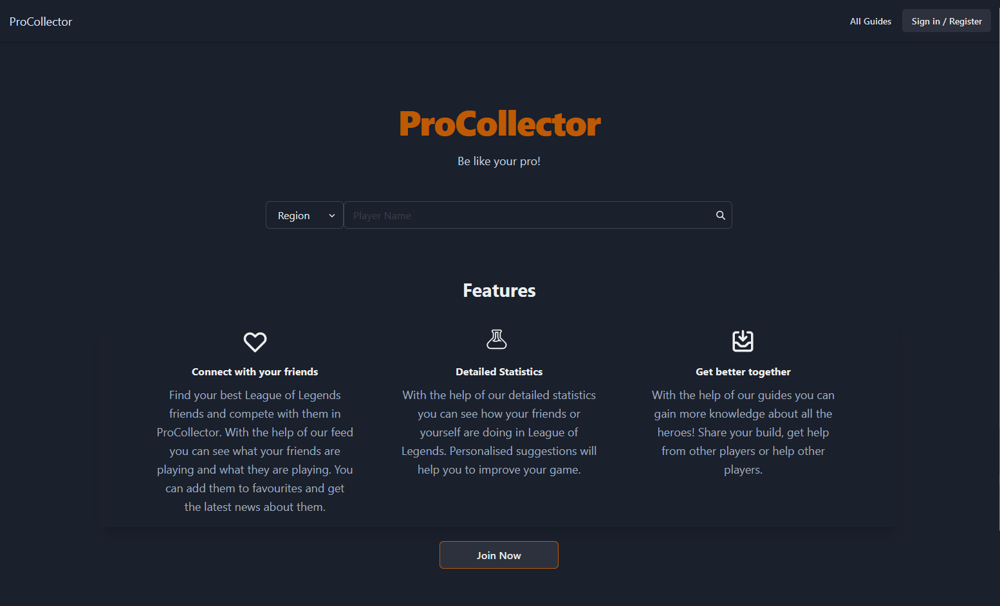
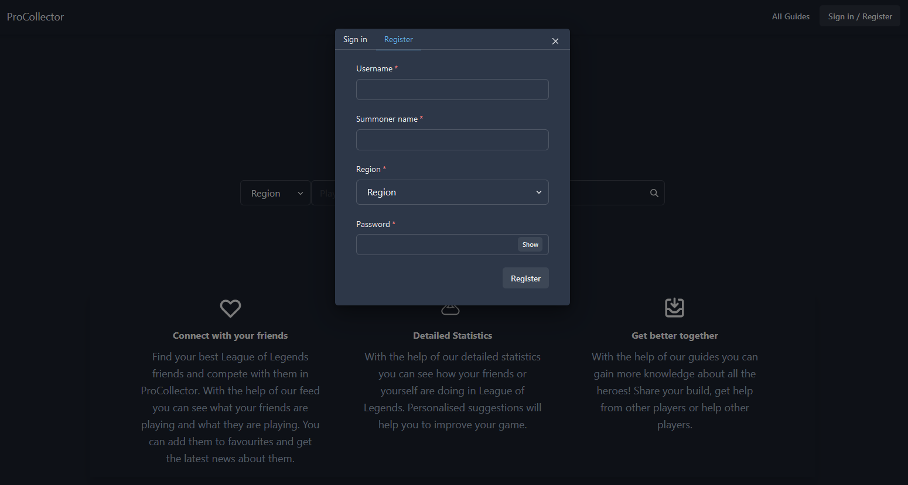
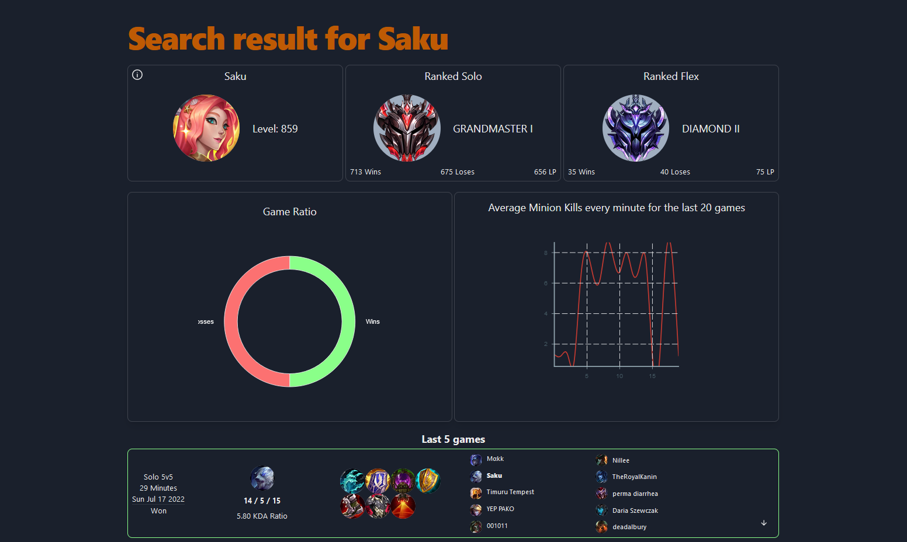
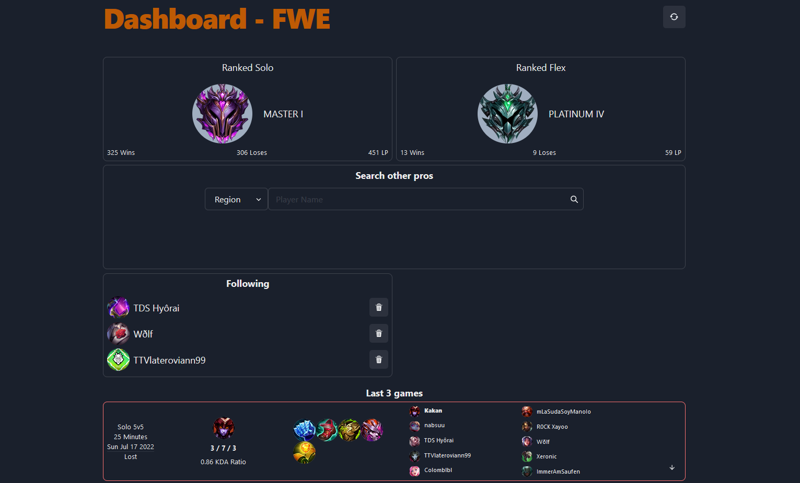
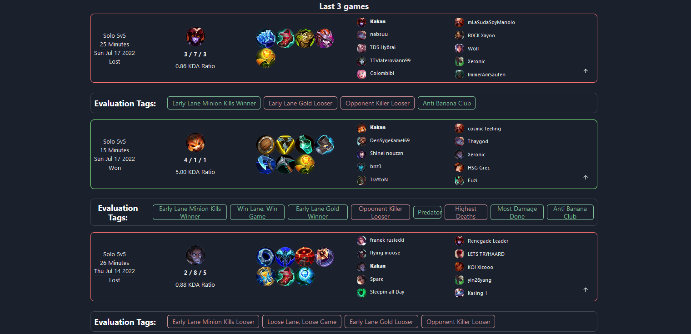

## Available Scripts

In the project directory, you can run:

### `yarn install`

Installs the dependencies for the project.

### `yarn start`

Runs the app in the development mode.  Open
[http://localhost:3000](http://localhost:3000) to view it in the browser.

The page will reload if you make edits.  You will also see any lint errors
in the console.

### `yarn test`

Launches the test runner in the interactive watch mode.  See the section
about
[running tests](https://facebook.github.io/create-react-app/docs/running-tests)
for more information.

### `yarn build`

Builds the app for production to the `build` folder.  It correctly bundles
React in production mode and optimizes the build for the best performance.

The build is minified and the filenames include the hashes.  Your app is
ready to be deployed!

See the section about
[deployment](https://facebook.github.io/create-react-app/docs/deployment) for
more information.

## Used libraries

- Chakra UI: [Chakra UI](https://chakra-ui.com/)
- Draft.js: [Draft.js](https://draftjs.org/)
- React: [React](https://reactjs.org/)
- OpenApiGenerator

## **Landing Page**

Bei der Landing Page kann man nach einem Summoner suchen, sich anmelden oder registrieren und alle erstellte Guides von den Usern zu betrachten.
Für die Suche und Registrierung schlagen wir folgende Summoner für die Region EUW vor:
MagiFelix5,
Targamas,
Gabbo,
Kakan

## **Login/Register**

Entweder mit vorhanden User anmelden oder einen neuen User registrieren.

## **Summoner Search**

Hier werden einen allgemeine Informationen zum Summoner angezeigt und seine letzten Spiele. Die Informationen werden direkt aus der RiotApi geladen.
Wenn man angemeldet ist, kann mit mit einen klick auf das Summoner Icon einen Summonr folgen und man kann ein Match bewerten.

## **Dashboard**

Beim Dashboard wird der zugehörige Summoner und Follower für den User aus der Datenbank geladen.
Es ist möglich seine Follower zu entfernen und man kann auch den Summoner von dem User aktualisieren.

## **Evaluation**

Für ein Match kann eine Bewertung erstellt werden. Jede Bewertung enthält eine Beschreibung.
Wenn man sich im Dashboard befindet werden die Bewertungen in der Datenbank gespeichert, aber wenn man einen Match bewertet für gesuchten Summoner werden Bewertungen nur temporär angezeigt.

## **Guides**

Es können alle Guides (All Guides) von allen Usern angezeigt werden und die Guides von den eingeloggten User (My Guides). Die Guides können mit den Titel gefiltert werden.
Bei "My Guides" können Guides erstellt, bearbeitet und gelöscht werden.

## **Settings**

In den Einstellungen kann für einen eingeloggten User der Summoner geändert werden. Es wird zunächst in der Datenbank nachgeschaut ob dieser Summoner bereits vorhanden ist, wenn nicht wird der Summoner von der RiotApi geholt. 
